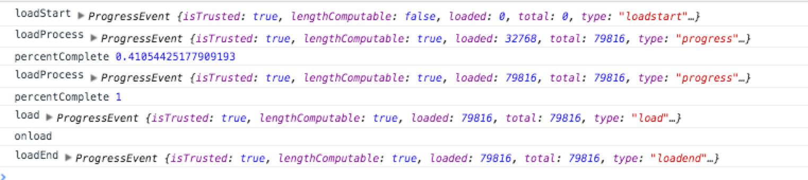
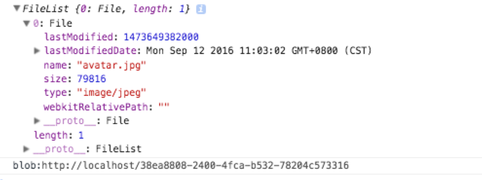
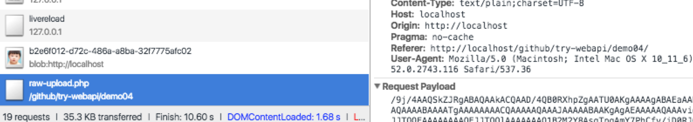
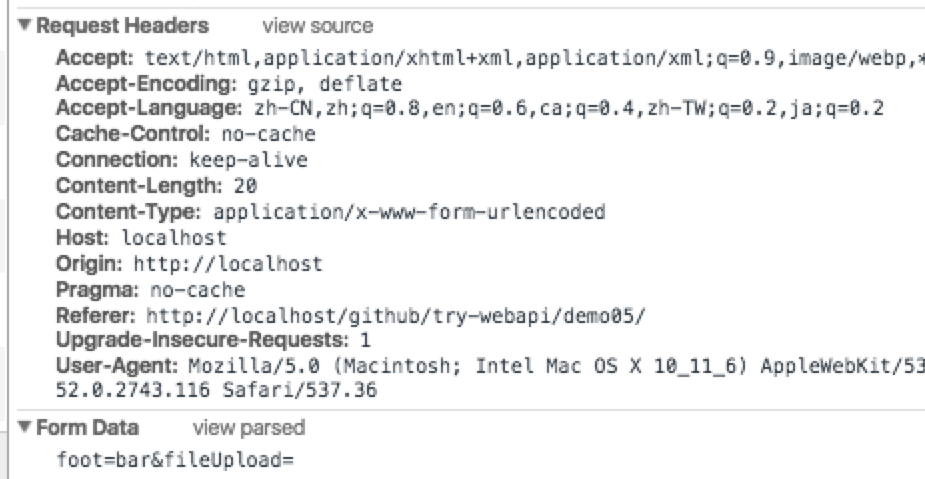
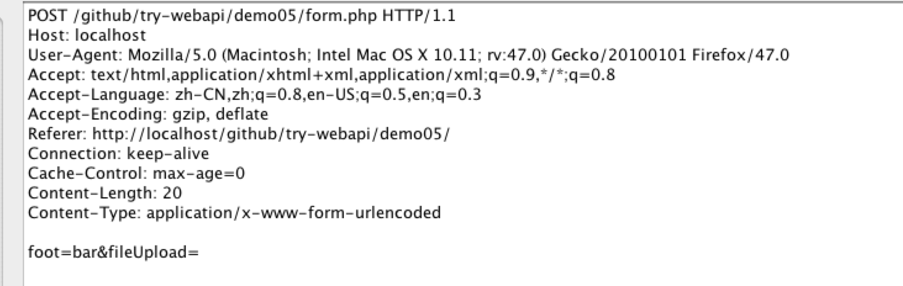

## MDN Web API

## Index

- [XMLHttpRequest](#xmlhttprequest)
  - [HTML解析](#html解析)
  - [二进制](#二进制)
  - [监测进度](#监测进度)
  - [Raw Data 上传](#raw-data-上传)
  - [Form and FormData](#form-and-formdata)
  - [CORS](#cors)
- [DocumentFragment](#documentfragment)
- [ArrayBuffer Blob TypedArray](#arraybuffer-blob-typedarray)
- [Base64](#base64)
- [Web workers](#web-workers)
- [Http Headers](#http-headers)
- [MIME type](#mime-type)
- [window.URL](#raw-data-上传)
- [FileReader](#raw-data-上传)
- [FormData](#form-and-formdata)
- [WebSockets](#websockets)

一下API使用时需要重新确认浏览器兼容情况

## XMLHttpRequest
> AJAX (Asynchronous JavaScript and XML)代表异步Javascript & XML, 不要局限于其字面，XMLHttpRequest可以接受任何格式数据、支持的协议也不仅限于HTTP（file、ftp也可）

Demo01

- XMLHttpRequest
  - onreadystatechange
  - Request
    - setResponseHeader
    - open()
      - method
        - GET/POST/HEAD等必须大写
      - url
        - 同源策略，不能跨域名(域名或端口有差异)访问，
      - async
        - 使用异步模式，不要使用false，false会阻塞页面渲染影响用户体验
    - send()
      - null / ArrayBuffer / Blob / Document / DOMString(string) / FormData
    - abort()
    - timeout
    - withCredentials
    - [CORS](#cors)
  - Response
    - getResponseHeader()
    - getAllResponseHeaders()
    - overrideMimeType()
      - 强制修改返回数据类型
    - response
    - responseText
    - responseURL
    - responseType
      - "" / arraybuffer / blob / document / json / text
    - responseXML
    - readyState
      - 0 (未初始化) open尚未调用
      - 1 (正在装载) send未调用
      - 2 (装载完毕) send已调用，且响应头和响应状态已返回
      - 3 (交互中)   body下载中 responseText已获取部分数据
      - 4 (完成)  整个请求过程完毕
    - status
      - 200 状态码
        - 1xx 信息
        - 2xx 成功
        - 3xx 重定向 如：302 重定向、304 未修改
        - 4xx 客户端错误 如：403 不允许、 404 未找到
        - 5xx 服务端错误 如： 503 服务器down、503 超时
    - statusText
      - 完整状态描述 “200 ok”
  - 在终止XMLHttpRequest之前不要gc


```js
function makeRequest (url) {
  // Mozilla, Safari
  httpRequest = new XMLHttpRequest()
  httpRequest.onreadystatechange = readyCall
  httpRequest.onload = onLoad
  httpRequest.open('GET', url, true)
  httpRequest.send(null)
}

function readyCall () {
  console.log(httpRequest)
  if (httpRequest.readyState === 4) {
    if (httpRequest.status === 200) {
      console.log('text', httpRequest.responseText)
      console.log('text', httpRequest.responseXML)
      console.log('xml', httpRequest.responseXML, httpRequest.responseXML.getElementsByTagName('a'))
    } else {
      console.log('error')
    }
  }
}
```

### HTML解析

Demo02

- XMLHttpRequest.responseXML
  - `XMLHttpRequest.responseType = "document"`  预先定义`responseType`以`Document`解析
  - 注意，此时不用调用 `XMLHttpRequest.responseText`
  - FF可以正常识别，chrome不能识别
  - html非xml格式，所以FF识别的文档XML对象存在但是无法使用
  - `responseType`
- DocumentFragment
  - 将html插入到文档片段中，解析成DOM对象，通过DOM操作，只不过根路径不是`document` 见[DocumentFragment](#documentfragment)
- RegExp
  - 性能堪忧，不建议使用

```js

function makeRequest (url) {
  httpRequest = new XMLHttpRequest()

  // ff 下此代码有效，
  if (httpRequest.overrideMimeType) {
    httpRequest.overrideMimeType('text/xml')
  }

  httpRequest.onreadystatechange = readyCall
  httpRequest.onload = onLoad
  httpRequest.open('GET', url, true)
  // httpRequest.setRequestHeader('Content-Type',  'text/xml');
  httpRequest.responseType = "document"
  httpRequest.send(null)
}

function readyCall () {
  console.log(httpRequest)
  if (httpRequest.readyState === 4) {
    if (httpRequest.status === 200) {
      // Uncaught InvalidStateError: Failed to read the 'responseText' property from 'XMLHttpRequest': The value is only accessible if the object's 'responseType' is '' or 'text' (was 'document').readyCall @ index.js:25XMLHttpRequest.send (async)makeRequest @ index.js:18(anonymous function)
      // console.log('text', httpRequest.responseText)
      // var frag
      console.log('xml', httpRequest.responseXML)
    } else {
      console.log('error')
    }
  }
}
```

### 二进制

Demo03

- `responseType = 'arraybuffer'`
- `xhr.response`

```js
// ArrayBuffer
fetch('avatar.jpg', 'arraybuffer').then(function(xhr) {
  console.log(xhr);
  var arrayBuffer = xhr.response
  var byteArray
  if (arrayBuffer) {
    byteArray = new Uint8Array(arrayBuffer)
    console.log(byteArray)
    byteArray = new Int8Array(arrayBuffer)
    console.log(byteArray)
    byteArray = new Uint16Array(arrayBuffer)
    console.log(byteArray)
    byteArray = new Int16Array(arrayBuffer)
    console.log(byteArray)
  }
})
```


更多示例请参考 [ArrayBuffer Blob TypedArray](#arraybuffer-blob-typedarray) 。

### 监测进度

Demo04

- loadstart -> progress -> load/error/abort -> loadend
- `xhr.onprogress`
  - 下载用
- `xhr.upload`
  - 上传用
- `progress`
  - `e.lengthComputable` 是否正确识别文件大小
  - `e.loaded` 已加载的字节数
  - `e.total` 总的字节数

```js
var xhr = new XMLHttpRequest()
// e.lengthComputable = false 此时总字节数位置
xhr.addEventListener('loadstart', loadStart)
xhr.addEventListener('progress', loadProgress)
xhr.upload.addEventListener('progress', loadProgress)
xhr.addEventListener('error', loadError)
xhr.addEventListener('abort', loadAbort)
xhr.addEventListener('load', loaded)
// abort、load、error 皆会触发 loadend
xhr.addEventListener('loadend', loadEnd)
// xhr.overrideMimeType('text/plain; charset=x-user-defined-binary');
xhr.open(method, url)

// 简写
xhr.onload = function (processEvent) {
  console.log('onload')
}
xhr.send(data || null);

function loadProgress(e) {
  console.log('loadProcess', e)
  if (e.lengthComputable) {
    var percentComplete = e.loaded / e.total
    console.log('percentComplete', percentComplete)
  }
}
```




### Raw Data 上传

Demo04

- `window.URL`
  - `URL.createObjectURL(blob)`
    - `blob` Is a File object or a Blob object to create a object URL for.
    - 可实现图片的本地预览
  - `URL.revokeObjectURL(objectURL)`
    - 不使用的时候销毁
  - 可用于借助iframe展示pdf文件
  - 可用于获取当前播放音视频信息
- `FileReader`
  - `readAsArrayBuffer`
  - `readAsBinaryString`
  - `readAsDataURL`
  - `readAsText`
  - `readyState`
    - 0 empty
    - 1 loading
    - 2 done
  - `onload`
  - `result`
    - String or ArrayBuffer
    - `btoa(e.target.result)`
      - [`Base64`编码](#base64)
      - 不经编码服务器无法正常识别

```js
// #3
var fileUpload = document.getElementById('fileUpload');
var imgUpload = document.getElementById('imgUpload');
fileUpload.onchange = function() {
  console.log(this.files)
  var theFile = this.files[0]

  // 预览： createObjectURL（blob object or file object)
  var theFileUrl = window.URL.createObjectURL(theFile)
  imgUpload.src = theFileUrl;

  // 上传：原始格式上传
  var reader = new FileReader();
  reader.readAsBinaryString(theFile);
  reader.onload = function(e) {
    // this.result
    console.log(this.result);
    fetch('POST', 'raw-upload.php', btoa(e.target.result))
    window.URL.revokeObjectURL(theFileUrl)
  }
}
```




- php
  - 5.6以后需要配置HTTP_RAW_POST_DATA的支持
  - 读取输入流 `file_get_contents("php://input")`

```php
// 5.6以后需要配置HTTP_RAW_POST_DATA的支持
$postdata = base64_decode(file_get_contents("php://input"));
// echo __FILE__;
$basedir = dirname(__File__);
if($postdata) {
  $handle = fopen($basedir."/avatar-uploaded.jpg", "w+");
  fwrite($handle, $postdata);
  fclose($handle);
}
```

### Form and FormData

- 提交表单
  - AJAX
  - FormData
    - 简洁但是数据不是字符串
  - html <form>
    - 使用 `POST` 方法，并设置 `enctype` 属性为 `application/x-www-form-urlencoded` (默认)
    - 使用 `POST` 方法，并设置 `enctype` 属性为 `text/plain`
    - 使用 `POST` 方法，并设置 `enctype` 属性为 `multipart/form-data`
    - 使用 `GET` 方法（这种情况下 `enctype` 属性会被忽略）

```
Content-Type: application/x-www-form-urlencoded

foo=bar&baz=The+first+line.&#37;0D%0AThe+second+line.%0D%0A
```

```
Content-Type: text/plain

foo=bar
baz=The first line.
The second line.
```

```
Content-Type: multipart/form-data; boundary=---------------------------314911788813839

-----------------------------314911788813839
Content-Disposition: form-data; name="foo"

bar
-----------------------------314911788813839
Content-Disposition: form-data; name="baz"

The first line.
The second line.

-----------------------------314911788813839--
```

```
// 附加到URL
?foo=bar&baz=The%20first%20line.%0AThe%20second%20line.
```

- 以  `Content-Type: application/x-www-form-urlencoded` 为例，报文实例如下图





### CORS
> cross-origin sharing standard

- XMLHttpRequest 发起跨站请求
  - withCredentials 是否可以携带 cookies、验证头信息等
  - 服务端支持，如下：nginx 配置
    - response头信息必须有以下支持
    - Access-Control-Allow-Credentials true
    - Access-Control-Allow-Origin * 的情况下withCredentials无效
    - Access-Control-Allow-Origin http://example.com 必须指定域名情况下的情况下withCredentials才有效，才能携带cookie
    - Access-Control-Allow-Methods
      - OPTIONS 选项必须要有，因为部分浏览器POST数据之前会先发送OPTIONS的请求判断是否可POST权限
  - Internet Explorer 8 和 9 通过 XDomainRequest 对象来实现CORS
- Web字体（@font-face 引用跨站字体文件）
- WebGL贴图 ？
- drawImage 在 canvas 上画图


```
//nginx 配置demo
add_header 'Access-Control-Allow-Origin' 'http://example.com';
add_header 'Access-Control-Allow-Credentials' 'true';
add_header 'Access-Control-Allow-Methods' 'GET, POST, OPTIONS, PUT, DELETE';
add_header 'Access-Control-Allow-Headers' 'Origin, X-Authorization-Token, No-Cache, X-Requested-With, If-Modified-Since, Pragma, Last-Modified, Cache-Control, Expires, Content-Type, X-E4M-With';
```

```js
var xhr = new XMLHttpRequest();
xhr.open('GET', 'http://example.com/', true);
xhr.withCredentials = true;
xhr.send(null);
```

## DocumentFragment

## ArrayBuffer Blob TypedArray

- TypedArray
  - Int8Array
  - Uint8Array
  - Uint8ClampedArray
  - Int16Array
  - Uint16Array
  - Int32Array
  - Uint32Array
  - Float32Array
  - Float64Array
  - DataView

参考

- https://jiangdl.com/notes/possibilities-of-array-buffer-and-typed-array
- http://shihuacivis.github.io/2015/12/29/20151229_arrayBuffer/

## Base64
> Base64是一组相似的二进制到文本(binary-to-text)的编码规则，使得二进制数据在解释成radix-64的表现形式后能够用ASCII字符串的格式表示出来
> Base64编码普遍应用于需要通过被设计为处理文本数据的媒介上储存和传输二进制数据而需要编码该二进制数据的场景

- `atob` 解码
- `btoa` 编码

## Web workers

## Http Headers

- Connection: Keep-Alive

## MIME type

## WebSockets

Demo06

- WebSocket
- CloseEvent
- MessageEvent
- Events
  - open
  - message
  - error
  - close

### Request

- Sec-WebSocket-Version
- Sec-WebSocket-Extensions
- Sec-WebSocket-Key
- Connection
- Upgrade: websocket

```
CONNECT localhost:8099 HTTP/1.1
User-Agent: Mozilla/5.0 (Macintosh; Intel Mac OS X 10.11; rv:47.0) Gecko/20100101 Firefox/47.0
Proxy-Connection: keep-alive
Connection: keep-alive
Host: localhost:8099

GET / HTTP/1.1
Host: localhost:8099
User-Agent: Mozilla/5.0 (Macintosh; Intel Mac OS X 10.11; rv:47.0) Gecko/20100101 Firefox/47.0
Accept: text/html,application/xhtml+xml,application/xml;q=0.9,*/*;q=0.8
Accept-Language: zh-CN,zh;q=0.8,en-US;q=0.5,en;q=0.3
Accept-Encoding: gzip, deflate
Sec-WebSocket-Version: 13
Origin: http://localhost
Sec-WebSocket-Extensions: permessage-deflate
Sec-WebSocket-Key: brXxGM42siYVVzk8+XDDWQ==
Connection: keep-alive, Upgrade
Pragma: no-cache
Cache-Control: no-cache
Upgrade: websocket
```

### Response

```
HTTP/1.1 101 Switching Protocols
Upgrade: websocket
Connection: Upgrade
Sec-WebSocket-Accept: 1ar9FFKGP0t2xT+kSeWXpQfUAKI=

11111111111111111111111111111111111111111111111
```


参考

- https://www.ibm.com/developerworks/cn/web/1112_huangxa_websocket/
- https://www.npmjs.com/package/nodejs-websocket
- https://nodejs.org/api/fs.html


## 参考资料

- https://developer.mozilla.org/zh-CN/docs/AJAX
- https://xhr.spec.whatwg.org/#dom-xmlhttprequest-upload
- https://developer.mozilla.org/en-US/docs/Web/API/XMLHttpRequest/Sending_and_Receiving_Binary_Data
- http://shihuacivis.github.io/2015/12/29/20151229_arrayBuffer/
- https://jiangdl.com/notes/possibilities-of-array-buffer-and-typed-array
