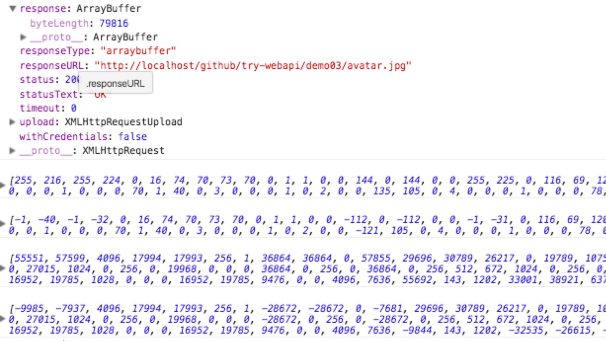

## MDN Web API

## Index

## AJAX
> AJAX (Asynchronous JavaScript and XML)代表异步Javascript & XML

[MDN - AJAX](https://developer.mozilla.org/zh-CN/docs/AJAX)


### XMLHttpRequest
> 不要局限于其字面，XMLHttpRequest可以接受任何格式数据、支持的协议也不仅限于HTTP（file、ftp也可）

Demo01

- XMLHttpRequest
  - open()
    - method
      - GET/POST/HEAD等必须大写
    - url
      - 同源策略，不能跨域名(域名或端口有差异)访问，
    - async
      - 使用异步模式，不要使用false，false会阻塞页面渲染影响用户体验
  - send()
    - 内容必须是字符串
  - onreadystatechange
    - responseText
    - responseXML
    - readyState
      - 0 (未初始化)
      - 1 (正在装载)
      - 2 (装载完毕)
      - 3 (交互中)
      - 4 (完成)
    - status
    - statusText


```js
function makeRequest (url) {
  // Mozilla, Safari
  httpRequest = new XMLHttpRequest()
  httpRequest.onreadystatechange = readyCall
  httpRequest.onload = onLoad
  httpRequest.open('GET', url, true)
  httpRequest.send(null)
}

function readyCall () {
  console.log(httpRequest)
  if (httpRequest.readyState === 4) {
    if (httpRequest.status === 200) {
      console.log('text', httpRequest.responseText)
      console.log('text', httpRequest.responseXML)
      console.log('xml', httpRequest.responseXML, httpRequest.responseXML.getElementsByTagName('a'))
    } else {
      console.log('error')
    }
  }
}
```

#### HTML解析

Demo02

- XMLHttpRequest.responseXML
  - `XMLHttpRequest.responseType = "document"`  预先定义`responseType`以`Document`解析
  - 注意，此时不用调用 `XMLHttpRequest.responseText`
  - FF可以正常识别，chrome不能识别
  - html非xml格式，所以FF识别的文档XML对象存在但是无法使用
  - `responseType` - `Living Strandard` 浏览器支持情况未知
- DocumentFragment
  - 将html插入到文档片段中，解析成DOM对象，通过DOM操作，只不过根路径不是`document` 见[DocumentFragment](#documentfragment)
- RegExp
  - 性能堪忧，不建议使用

```js

function makeRequest (url) {
  httpRequest = new XMLHttpRequest()

  // ff 下此代码有效，
  if (httpRequest.overrideMimeType) {
    httpRequest.overrideMimeType('text/xml')
  }

  httpRequest.onreadystatechange = readyCall
  httpRequest.onload = onLoad
  httpRequest.open('GET', url, true)
  // httpRequest.setRequestHeader('Content-Type',  'text/xml');
  httpRequest.responseType = "document"
  httpRequest.send(null)
}

function readyCall () {
  console.log(httpRequest)
  if (httpRequest.readyState === 4) {
    if (httpRequest.status === 200) {
      // Uncaught InvalidStateError: Failed to read the 'responseText' property from 'XMLHttpRequest': The value is only accessible if the object's 'responseType' is '' or 'text' (was 'document').readyCall @ index.js:25XMLHttpRequest.send (async)makeRequest @ index.js:18(anonymous function)
      // console.log('text', httpRequest.responseText)
      // var frag
      console.log('xml', httpRequest.responseXML)
    } else {
      console.log('error')
    }
  }
}
```

#### 二进制



```js
// ArrayBuffer
fetch('avatar.jpg', 'arraybuffer').then(function(xhr) {
  console.log(xhr);
  var arrayBuffer = xhr.response
  var byteArray
  if (arrayBuffer) {
    byteArray = new Uint8Array(arrayBuffer)
    console.log(byteArray)
    byteArray = new Int8Array(arrayBuffer)
    console.log(byteArray)
    byteArray = new Uint16Array(arrayBuffer)
    console.log(byteArray)
    byteArray = new Int16Array(arrayBuffer)
    console.log(byteArray)
  }
})
```

更多示例请参考 [ArrayBuffer Blob TypedArray](#arraybuffer-blob-typedarray) 。

#### 监测进度

#### 表单数据

#### 跨站


## DocumentFragment

## ArrayBuffer Blob TypedArray

- TypedArray
  - Int8Array
  - Uint8Array
  - Uint8ClampedArray
  - Int16Array
  - Uint16Array
  - Int32Array
  - Uint32Array
  - Float32Array
  - Float64Array
  - DataView


参考资料

- https://developer.mozilla.org/en-US/docs/Web/API/XMLHttpRequest/Sending_and_Receiving_Binary_Data
- http://shihuacivis.github.io/2015/12/29/20151229_arrayBuffer/
- https://jiangdl.com/notes/possibilities-of-array-buffer-and-typed-array

## 其他

- FormData
- CORS
